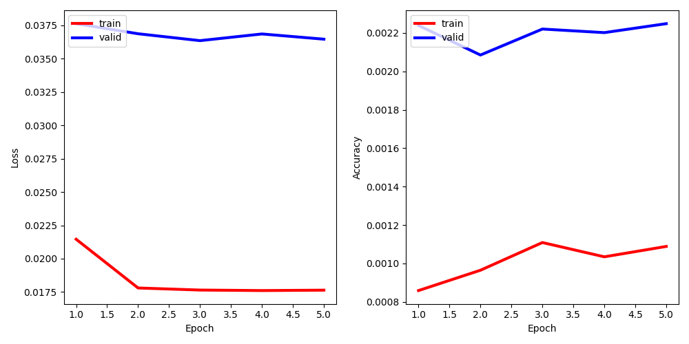

Based on  https://github.com/ruxuan666/VQA_program
# Paper

Pytorch implementation of the paper - VQA: Visual Question Answering (https://arxiv.org/pdf/1505.00468.pdf).


# Requirements 

**For Reference Only**

1. Python 3.7.3
2. torch 1.5.0
3. torchvision 0.6.0
4. other basic Python packages like numpy, etc. 

# Usage 

### 1. Download and unzip the dataset from official url of VQA: https://visualqa.org/download.html.

```bash
$ cd VQA_program/utils
$ chmod +x download_extract.sh
$ ./download_extract.sh
```

After downloading `annotations`, `questions` and  `images`, reorganize the VQA folder like the format below, since the path may be different. 

- /VisualQA
  - /annotations
    - /v2_mscoco_train2014_annotations.json
    - /v2_mscoco_val2014_annotations.json
  - /questions
    - /v2_OpenEnded_mscoco_train2014_questions.json
    - /v2_OpenEnded_mscoco_val2014_questions.json
    - /v2_OpenEnded_mscoco_test2015_questions.json
    - /v2_OpenEnded_mscoco_test-dev2015_questions.json
  - /images
    - /train2014
      - /COCO_train2014_xxxxxxxxxxxx.jpg
    - /val2014
      - /COCO_val2014_xxxxxxxxxxxx.jpg
    - /test2015
      - /COCO_test2014_xxxxxxxxxxxx.jpg

### 2. Preproccess input data for (images, questions and answers).

```bash
#1, Resize image.
$ python resize_images.py --input_dir='~/VisualQA/images' --output_dir='../datasets' 
#2, Make vocabs for questions and answers, 0:<pad>,1:<unk>; select top 1k answers, 0:<unk>. Making it a super multiple choices problem. 
$ python make_vacabs_for_questions_answers.py --input_ques_dir='~/VisualQA/questins' --input_anno_dir='~/VisualQA/annotations' --output_dir='../datasets' --n_answers=1000
#3, Combine images (including name path), questions (question_id, sentence, word_list) and answers (all 10 answers, valid answer list); select one answer in valid answers as label. 
$ python build_vqa_inputs.py --input_dir='~/VisualQA' --output_dir='../datasets'
```

After these steps, the `/datasets` folder should look like this:

- /VisualQA_Project
  - /datasets
    - /annotations
      - /vocab_answers.txt
    - /images
      - /train2014
        - /COCO_train2014_xxxxxxxxxxxx.jpg
      - /val2014
        - /COCO_val2014_xxxxxxxxxxxx.jpg
      - /test2015
        - /COCO_test2015_xxxxxxxxxxxx.jpg
    - /preprocessed_data
      - /test-dev.npy
      - /test.npy
      - /train_valid.npy
      - /train.npy
      - /valid.npy
    - /questions
      - /vocab_questions.txt

### 3. Train model for VQA task.

```bash
# Load data and start training after built the VQA model
$ cd ..
$ python train.py
# or
$ python train.py --input_dir='./datasets' --log_dir='./logs', --model_dir='./models', --max_qst_length=30, --max_num_ans=10, --embed_size=1024, --word_embed_size=300, --num_layers=2, --hidden_size=512, --learning_rate=1e-3, --step_size=10, --gamma=0.1, --num_epochs=30, --batch_size=156, --num_workers=8, --save_step=1
# Parameter help
	#1, input_dir, input directory for visual question answering.
	#2, log_dir, directory for logs.
	#3, model_dir, directory for saved models.
	#4, max_qst_length, maximum length of question. The length in the VQA dataset = 26.
	#5, max_num_ans, maximum number of answers.
	#6, embed_size, embedding size of feature vector for both image and question.
	#7, word_embed_size, embedding size of word used for the input in the LSTM.
	#8, num_layers, number of layers of the RNN(LSTM).
	#9, hidden_size, hidden_size in the LSTM.
	#10,learning_rate, learning rate for training.
	#11,step_size, period of learning rate decay.
	#12,gamma, multiplicative factor of learning rate decay.
	#13,num_epochs, number of epochs.
	#14,batch_size, batch size.
	#15,num_workers, number of processes working on cpu (multithreading). On MacOS, 0 is suggested, because if num_workers > 0, IDLE may raise error `The program is still running. Do you want to kill it?` and the program will be killed. 
	#16,save_step, save step of model.
```
### 4. Show results using plotter.py

- **Loss and Accuracy on VQA datasets v2**


*PS: Limited by i5 cpu and no gpu, after 4-hour training, the performance is still bad, which may be better using the server.*

